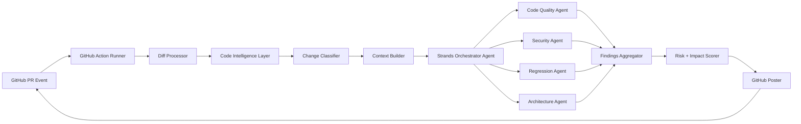
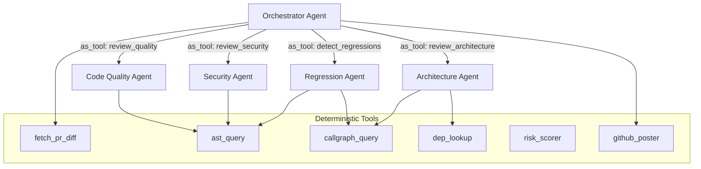
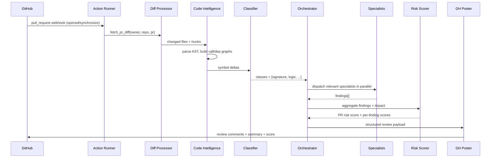
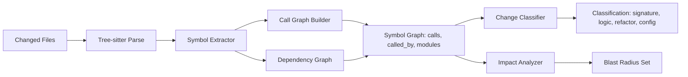

# MergeGuard — Detailed Build Plan

A multi-agent PR reviewer built on **AWS Strands SDK** with a deterministic **Code Intelligence Layer** (Tree-sitter AST + call/dep graph), risk + impact scoring, and **GitHub Action** delivery. Default LLM: **Claude on AWS Bedrock**. Targets Python, TS/JS, Go, Java from Phase 2.

---

## 1. Architecture Overview




The deterministic layers (Diff, CIL, Classifier, Scorer) are the structural backbone; LLM agents reason **on top of structured facts**, not raw diffs.

---

## 2. Project Layout

```
mergeguard/
  pyproject.toml
  action.yml                       # GitHub Action manifest
  Dockerfile                       # Action runtime (python:3.12-slim)
  README.md
  .github/workflows/ci.yml
  src/mergeguard/
    __init__.py
    cli.py                         # `mergeguard review` entrypoint
    config.py                      # env + .mergeguard.yml loader
    diff/
      parser.py                    # unidiff-based hunk parsing
      hunk_mapper.py               # map hunks -> file lines pre/post
    intelligence/
      tree_sitter_loader.py        # grammar bundle + Language() registry
      symbol_extractor.py          # functions/classes/methods + ranges
      call_graph_builder.py        # intra + inter-file edges
      dependency_graph.py          # import/module edges
      change_classifier.py         # signature|logic|refactor|config
      cache.py                     # per-PR + per-commit cache
    scoring/
      severity.py                  # finding severity model
      impact.py                    # BFS blast radius on call graph
      pr_score.py                  # combined PR risk score
    agents/
      base.py                      # shared Strands Agent helpers
      orchestrator.py              # planner + dispatcher
      code_quality.py
      security.py
      regression.py
      architecture.py
    tools/                         # Strands @tool functions
      fetch_pr_diff.py
      ast_query.py
      dep_lookup.py
      callgraph_query.py
      risk_scorer.py
      github_poster.py
    integrations/
      github.py                    # GitHub REST/GraphQL client
      bedrock.py                   # Strands BedrockModel factory
    telemetry/
      tracing.py                   # OTel via Strands hooks
  tests/
    fixtures/repos/                # tiny multi-lang repos
    unit/
    integration/
    e2e/                           # records GitHub fixtures via VCR
```

Key files to leverage from Strands SDK: `strands.Agent`, `strands.tools.tool`, `strands.models.BedrockModel`, `strands.agent.AgentResult`. The orchestrator uses Strands' built-in tool-calling loop; specialists are sub-agents invoked as tools.

---

## 3. Agent Topology




Specialists are exposed to the Orchestrator via Strands' **agent-as-tool** pattern so the Orchestrator can plan which experts to call based on Change Classifier output (e.g., skip Security agent for pure refactors).

---

## 4. End-to-End Sequence




---

## 5. Code Intelligence Flow




The symbol graph is the single source of truth handed to specialist agents via the `ast_query` / `callgraph_query` tools — agents query it instead of re-parsing.

---

## 6. Risk + Impact Scoring

- **Severity** (0–5) per finding from the producing specialist (rubric in `scoring/severity.py`).
- **Impact** = `min(5, log2(|blast_radius| + 1))` from BFS on `called_by` graph up to depth 3.
- **Finding score** = `severity * (1 + impact/5)`.
- **PR score** = weighted max + sum tail; bucketed to `LOW | MEDIUM | HIGH | BLOCKING`.
- Posted as a header in the GitHub review comment with a per-file breakdown table.

---

## 7. Phased Roadmap

### Phase 0 — Bootstrap (0.5 week)

- `pyproject.toml` (uv or poetry), Python 3.12, deps: `strands-agents`, `boto3`, `tree-sitter`, `tree-sitter-languages`, `unidiff`, `httpx`, `pydantic`, `networkx`, `rich`, `typer`.
- Dev: `ruff`, `mypy`, `pytest`, `pytest-recording` (VCR for GitHub).
- Bedrock auth via OIDC role for the Action; local dev via `AWS_PROFILE`.
- `ci.yml`: lint + typecheck + tests on PR.
- Stub `cli.py` with `mergeguard review --pr <url>` (no-op).

**Exit criteria:** `pytest` green; `mergeguard --help` works; Bedrock smoke test from CI.

### Phase 1 — Diff-based Reviewer MVP (1.5 weeks)

- `tools/fetch_pr_diff.py`: GitHub REST `pulls/{n}/files` + raw diff.
- `diff/parser.py` + `hunk_mapper.py` using `unidiff`.
- `integrations/bedrock.py`: `BedrockModel(model_id="anthropic.claude-sonnet-4-...")`.
- `agents/orchestrator.py`: single-pass agent that calls `fetch_pr_diff` + 2 specialists (Code Quality, Security) with file/hunk context.
- `tools/github_poster.py`: PR review with line comments via `pulls/{n}/reviews`.
- `action.yml` + `Dockerfile`; integration test against a fixture repo.

**Exit criteria:** End-to-end Action posts a review on a sample PR in a test repo.

### Phase 2 — Code Intelligence Layer + Classification (2 weeks)

- `intelligence/tree_sitter_loader.py`: load Python, TS, JS, Go, Java grammars; query files in `intelligence/queries/{lang}.scm`.
- `symbol_extractor.py`: emit `Symbol(name, kind, file, range, signature_hash)`.
- `call_graph_builder.py`: resolve calls within file via Tree-sitter; cross-file via import map (best-effort, language-specific resolvers).
- `dependency_graph.py`: per-language import edges (e.g., Python `import`/`from`, TS `import`, Go `import`, Java `import`).
- `change_classifier.py`: diff symbols pre/post → `signature | logic | refactor | config | docs | test`.
- Cache parsed graphs by `(repo, sha)` to a tmp dir or Action cache.
- `tools/ast_query.py`, `callgraph_query.py`, `dep_lookup.py` exposed to agents.

**Exit criteria:** Classifier produces correct labels on golden fixtures across all 4 languages; symbol graph queryable from agents.

### Phase 3 — Impact-aware Reasoning + Risk Scoring (1.5 weeks)

- `scoring/impact.py`: BFS blast radius on `called_by`; honors public API surface heuristics.
- `agents/regression.py`: deterministic pre-checks (removed/renamed callees, signature drift) → LLM verifies & explains; reduces false positives.
- `agents/architecture.py`: layering/boundary checks using `dep_lookup` (e.g., `web → core → infra` violations).
- `scoring/pr_score.py`: aggregate to PR-level bucket; produce markdown summary table.
- Update `github_poster.py` to render score header + collapsible per-finding details.

**Exit criteria:** On a curated benchmark of 20 PRs, regression precision ≥ 0.8 and PR score correlates with human-tagged risk.

### Phase 4 — Scale + Learning Loop (ongoing)

- `telemetry/tracing.py`: enable Strands OTel hooks → CloudWatch / Honeycomb.
- Feedback capture: parse 👍/👎 reactions on review comments and resolution status; persist to a `feedback/` sink (S3 or repo artifact).
- Few-shot retrieval: store accepted findings keyed by `(language, change_class)`; inject top-k as exemplars.
- Cost controls: model routing (Haiku for triage, Sonnet for deep reasoning), cache symbol graphs across runs.
- Optional: migrate to GitHub App + queue (SQS) for hosted multi-tenant mode.

**Exit criteria:** Cost per PR review < target; feedback loop measurably improves precision over 4 weeks.

---

## 8. Key Interfaces (essential snippets)

Strands agent skeleton in `src/mergeguard/agents/orchestrator.py`:

```python
from strands import Agent
from strands.models import BedrockModel
from mergeguard.tools import fetch_pr_diff, github_poster, ast_query, callgraph_query
from mergeguard.agents import code_quality, security, regression, architecture

def build_orchestrator() -> Agent:
    model = BedrockModel(model_id="anthropic.claude-sonnet-4-5-v1:0", region_name="us-east-1")
    return Agent(
        model=model,
        system_prompt=ORCHESTRATOR_PROMPT,
        tools=[
            fetch_pr_diff, github_poster, ast_query, callgraph_query,
            code_quality.as_tool(), security.as_tool(),
            regression.as_tool(), architecture.as_tool(),
        ],
    )
```

Tool decoration pattern in `src/mergeguard/tools/fetch_pr_diff.py`:

```python
from strands import tool
from pydantic import BaseModel

class PRRef(BaseModel):
    owner: str; repo: str; number: int

@tool
def fetch_pr_diff(ref: PRRef) -> dict:
    """Return changed files with hunks and head/base SHAs."""
    ...
```

GitHub Action manifest `action.yml` (essence):

```yaml
name: MergeGuard
description: AI PR Code Review Agent
inputs:
  aws-region: { default: us-east-1 }
runs:
  using: docker
  image: Dockerfile
  env:
    GITHUB_TOKEN: ${{ github.token }}
    AWS_REGION: ${{ inputs.aws-region }}
```

---

## 9. Test Strategy

- **Unit**: parsers (diff, AST), graph builders, classifier, scorer.
- **Golden fixtures** per language under `tests/fixtures/repos/{py,ts,go,java}/` with expected symbol graphs.
- **Agent tests**: replay LLM via `strands` test mocks; assert tool-call sequences, not prose.
- **Integration**: VCR-recorded GitHub interactions; one happy-path PR per language.
- **E2E (Phase 1+)**: real Action run against a sandbox repo on a nightly workflow.

---

## 10. Risks & Mitigations

- **Cross-file call resolution is hard for dynamic languages** → start with module-level imports + same-file resolution; mark cross-file as best-effort and let LLM verify.
- **Tree-sitter grammar drift** → pin `tree-sitter-languages` version; vendor `.scm` queries.
- **Bedrock latency/cost on large PRs** → chunk by file, parallelize specialists, cap tokens, route trivial classes (docs/test) to Haiku.
- **GitHub rate limits** → use ETags + conditional requests in `integrations/github.py`.
- **Hallucinated regressions** → deterministic gate in `regression.py` before LLM; never post a regression finding without a concrete removed/changed symbol.

---

## 11. Suggested Build Order for Claude Code Sessions

1. Phase 0 scaffold (one session).
2. Phase 1 MVP — split into 3 sessions: GitHub I/O, Strands agent + Bedrock wiring, Action packaging.
3. Phase 2 — split per language: Python first, then TS/JS, Go, Java.
4. Phase 3 — regression agent, then scoring, then architecture agent.
5. Phase 4 — telemetry first, then feedback store, then retrieval/few-shot.

